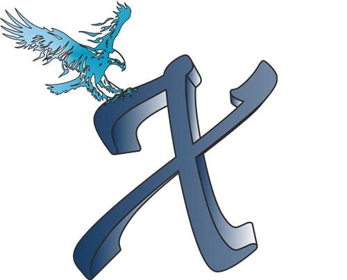

# X Game Master

Your companion to organize a fun game night (or day).

Important: This is not a game in itself it is just a tool to help you organize a match made from your own games.

## Idea

You absolutely need two things for a fun game night:
1. Players
2. Games

You probably have both of these and don't need an app for that.  But this app is your X factor to combine separate games to a unique gaming experience. So grab some friends and your favorite games and let the `X Game Master` transform it into an awesome competition.

## How it works

Note: a *game* refers to the thing you play in one round while a *match* refers to the whole sequence of games. 

### New Match
Start a match by entering the list of players (one per line) and the list of games (one per line). Feel free to use Emojis :rocket:
Player names have to be unique while you can duplicate game names (in separate lines) for the number of times you want to play them. A good game is one that can be played with two teams and a clear winner.
[Screenshots]

### Procedure
You play all entries in the game list in a random order exactly once. For each game the active players are assigned to one of two teams randomly. All players from the winning team get points according to the number of the round (1 in the first round, 2 in the second, and so on). The player with the highest sum after the last round is the overall winner.

### Game View
In the game view you see the name of the game and the players of each team. After you played the game in real life just press the button for the winning team accordingly.

### Leaderboard View
The leaderboard view is shown before and after every game. It shows the rank of each player together with the sum of their points and their status (active/inactive).

If a player can not play a round you can set them inactive by clicking on them in the leaderboard view. This player will not participate in any games until it is set active again and hence will not receive any points.

## Design principles

The app is designed to be clean and simple to use.
The UI is meant to be intuitive and pretty without unnecessary clutter.
Only features that proof to be desirable when playing the game will be considered to be included.

## Issues

If you find bugs or unexpected behaviour or if you have ideas for any kind of improvement please open an [issue on GitHub](https://github.com/iimog/x-party-game-app/issues).

## Logo

The game logo was designed by Tobias Ankenbrand

## Data Privacy

As outlined in our [data privacy statement](DATA_PRIVACY_STATEMENT) this app does not collect any user data.

## Change Log

### 0.3.0
- simplified design and game play
- complete re-write from <=0.2.1